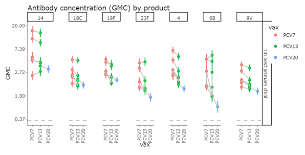
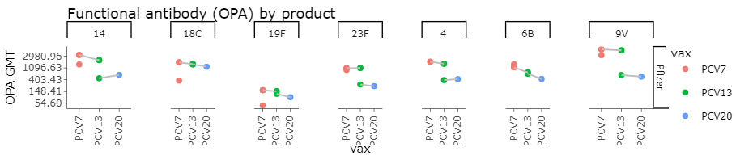
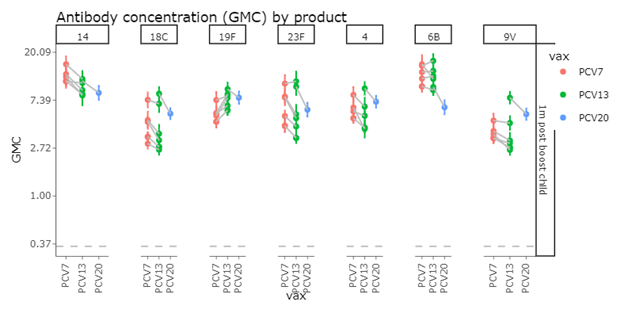
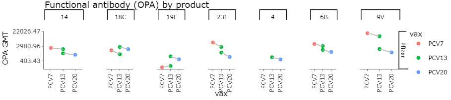
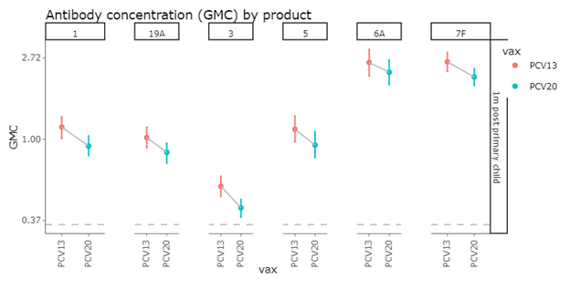
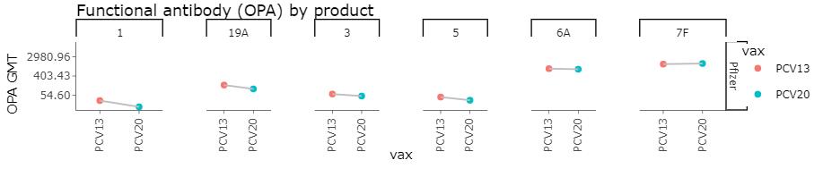
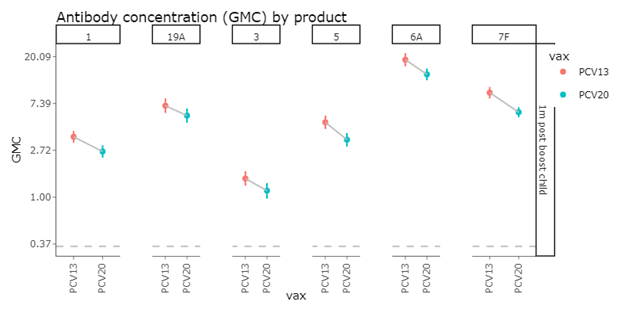
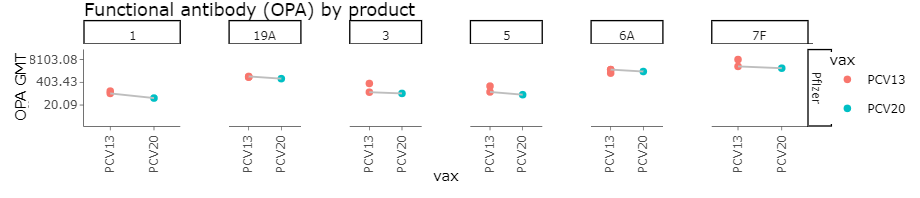

The seven-valent pneumococcal conjugate vaccine (PCV7) represented a significant
advancement in preventing serious pneumococcal disease in infants. The vaccine
has since been upgraded with additional serotypes — expanding to 13 serotypes,
then to 20 — to provide broader protection against invasive disease and to
address serotype replacement concerns. However, researchers have observed that
serotype-specific protection decreases as valency increases.

Immunogenicity is assessed through two primary methods: ELISA assays measuring
geometric mean concentrations of circulating antibody (IgG), and
opsonophagocytic assays (OPA) measuring antibody functionality. The analysis
below focuses on clinical trials using a **3+1 vaccination schedule** (three
primary doses in the first year, plus a booster around age one year).

## Original seven serotypes (present in all generations)

These serotypes — **4, 6B, 9V, 14, 18C, 19F, and 23F** — appear across PCV7,
PCV13, and PCV20.

### Post-primary IgG GMCs

Mean IgG responses to the seven original serotypes decrease as valency
increases, with PCV20 producing consistently lower responses than PCV13. Despite
lower antibody responses with increased valency, concentrations remain above the
protective thresholds for preventing invasive disease.

{fig-alt="Line chart of post-primary IgG geometric mean concentrations for serotypes 4, 6B, 9V, 14, 18C, 19F, and 23F, comparing PCV7, PCV13, and PCV20. GMCs decrease as vaccine valency increases, with PCV20 consistently lowest."}

### Post-primary OPA GMTs

OPA responses to the seven original serotypes follow the same declining trend as
IgG after the primary series, with PCV20 again producing the lowest geometric
mean titers of the three vaccines.

{fig-alt="Line chart of post-primary OPA geometric mean titers for serotypes 4, 6B, 9V, 14, 18C, 19F, and 23F, comparing PCV7, PCV13, and PCV20. Titers decrease as vaccine valency increases, with PCV20 consistently lowest."}

### Post-booster IgG GMCs

This declining pattern continues following the booster dose.

{fig-alt="Line chart of post-booster IgG geometric mean concentrations for serotypes 4, 6B, 9V, 14, 18C, 19F, and 23F, comparing PCV7, PCV13, and PCV20. As with the post-primary results, PCV20 shows the lowest GMCs."}

### Post-booster OPA GMTs

The same pattern holds for functional antibody after the booster dose: OPA
titers decline as valency increases, with PCV20 lowest among the three vaccines.

{fig-alt="Line chart of post-booster OPA geometric mean titers for serotypes 4, 6B, 9V, 14, 18C, 19F, and 23F, comparing PCV7, PCV13, and PCV20. Titers decline as valency increases, with PCV20 lowest."}

## Additional serotypes in PCV13 and PCV20

The six serotypes added in PCV13 — **1, 3, 5, 6A, 7F, and 19A** — show similar
patterns when comparing PCV13 and PCV20 responses.

### Post-primary IgG GMCs

Following the primary series, PCV20 elicited diminished IgG responses to the six
serotypes added in PCV13.

{fig-alt="Line chart of post-primary IgG geometric mean concentrations for serotypes 1, 3, 5, 6A, 7F, and 19A, comparing PCV13 and PCV20. PCV20 elicits lower GMCs than PCV13 for these serotypes."}

### Post-primary OPA GMTs

Functional antibody responses mirror the IgG results: PCV20 produces lower
post-primary OPA titers than PCV13 for these six serotypes.

{fig-alt="Line chart of post-primary OPA geometric mean titers for serotypes 1, 3, 5, 6A, 7F, and 19A, comparing PCV13 and PCV20. PCV20 produces lower titers than PCV13 for these serotypes."}

### Post-booster IgG GMCs

Similar patterns appeared in post-booster measurements.

{fig-alt="Line chart of post-booster IgG geometric mean concentrations for serotypes 1, 3, 5, 6A, 7F, and 19A, comparing PCV13 and PCV20. PCV20 remains lower than PCV13 after the booster dose."}

### Post-booster OPA GMTs

The same PCV20-lower-than-PCV13 pattern is seen in post-booster OPA titers for
these six serotypes.

{fig-alt="Line chart of post-booster OPA geometric mean titers for serotypes 1, 3, 5, 6A, 7F, and 19A, comparing PCV13 and PCV20. PCV20 remains lower than PCV13 after the booster dose."}

## Interpretation

::: {.wisspar-caveat}
Despite reduced responses with increased valency, all concentrations remain above
the correlate of protection (typically 0.35–0.40 μg/mL). However, important
considerations remain. The colonization protection threshold may be higher,
potentially reducing the ability to prevent vaccine-targeted serotype circulation
even when disease protection is maintained.
:::

Even if the protection is lower, the newer vaccines protect against more
serotypes. Comprehensive modeling would be needed to determine the overall
population-level benefits, weighing diminished immunogenicity against expanded
serotype coverage.
